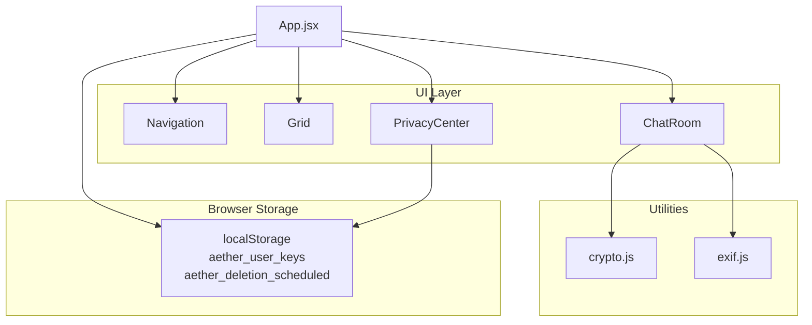
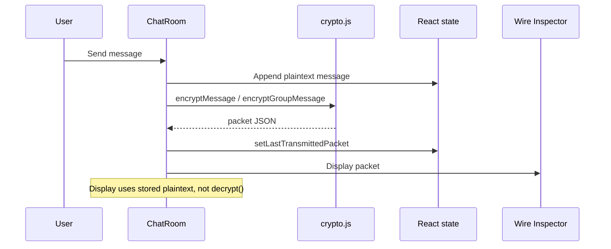

# Aether — Architecture

**Aether** is a single-page React application (Vite) with three primary surfaces: Discovery Grid, Encrypted Chats, and Privacy Center. All application state is client-side; there is no API layer.

---

## High-level diagram



---

## Tab routing

[`src/App.jsx`](../src/App.jsx) owns `currentTab`: `'grid' | 'chat' | 'privacy'`.

| UI label | `currentTab` | Component |
|----------|--------------|-----------|
| Discovery Grid (header) / **Grid** (bottom nav) | `grid` | `Grid` |
| Encrypted Chats (header) / **Chat** (bottom nav) | `chat` | `ChatRoom` |
| Privacy Center (header) / **Security** (bottom nav) | `privacy` | `PrivacyCenter` |

Additional global flags: `stealthMode`, `activeChatProfile`, `startWithAlbum`, `currentUser.keys`.

---

## Component responsibilities

| Component | File | Role |
|-----------|------|------|
| **App** | `src/App.jsx` | Root state: tabs, stealth, mock `profiles`, user key ring, panic wipe, key rotation, Grid → Chat handoff |
| **Navigation** | `src/components/Navigation.jsx` | Header brand, desktop tab buttons, stealth toggle, panic confirm modal, mobile drawer |
| **Grid** | `src/components/Grid.jsx` | Profile cards, stealth banner, profile detail modal, routes to chat or secure album |
| **ChatRoom** | `src/components/ChatRoom.jsx` | Conversations, send/reply simulation, wire inspector, self-destruct, secure album, EXIF tools |
| **PrivacyCenter** | `src/components/PrivacyCenter.jsx` | Fuzzing strategy UI, key ring display, rotation trigger, PIN/shield toggles, deletion grace, device wipe |

Entry: [`src/main.jsx`](../src/main.jsx) mounts `App` into `#root`.

---

## State and data

### Global (`App.jsx`)

| State | Purpose |
|-------|---------|
| `profiles` | Six mock discovery profiles (fuzzed distance strings, generative avatar colors) |
| `currentUser.keys` | Loaded from `aether_user_keys` or generated on mount |
| `stealthMode` | Invisible-mode banner; hides discovery grid when true |
| `albumScreenshotShield` | Album blur shield toggle (Privacy Center → ChatRoom) |
| `activeChatProfile` / `startWithAlbum` | Set when opening chat from Grid |
| `currentTab` | Active main view |

### ChatRoom-local

| State | Purpose |
|-------|---------|
| `conversations` | Per-thread message arrays (plaintext in state) |
| `albumPhotos` | Ephemeral album mock entries |
| `lastTransmittedPacket` | Last encrypt output for wire inspector |
| `selectedChat`, `showAlbum`, `showWireInspector` | View routing inside Chat |
| EXIF / shield / self-destruct | Tool and timer UI state |

### PrivacyCenter-local

| State | Purpose |
|-------|---------|
| `fuzzingStrategy` | Radio selection only |
| `pinLockEnabled` | UI toggle (prototype stub) |
| `isDeleting`, `deletionTimer` | 30-day grace countdown from LS |

---

## Cross-component flows

### Grid → Chat

```text
Grid.onSelectChat(profile, openAlbum)
  → App.setActiveChatProfile(profile)
  → App.setStartWithAlbum(openAlbum)
  → App.setCurrentTab('chat')
  → ChatRoom useEffect selects thread / opens album
```

### Panic wipe

[`App.jsx`](../src/App.jsx) `handlePanicTrigger`:

1. `localStorage.removeItem('aether_user_keys')`
2. `localStorage.removeItem('aether_deletion_scheduled')`
3. `setStealthMode(true)`, clear chat profile routing
4. Generate new keys and write `aether_user_keys`
5. `setCurrentTab('grid')`

Triggered from Navigation panic button (after confirm) or Privacy Center device wipe / expired deletion timer.

### Key lifecycle

```text
Mount → read aether_user_keys OR generateKeyPair → persist
Privacy Center "Rotate Keys" → handleRotateKeys → setupNewKeys
Panic wipe → new generateKeyPair → persist
```

---

## Crypto message path (simulated)



Relevant functions:

- 1:1: `encryptMessage(plaintext, senderPrivateKey, recipientPublicKey)` → packet; display does not call `decryptMessage` for sent bubbles.
- Group: stable `groupKey` in `ChatRoom` state (seed `GRP-KID-105`), then `encryptGroupMessage`.
- Auto-reply: `simulatePartnerResponse` builds a packet with mock partner keys.

See [SECURITY.md](SECURITY.md) for what is real vs cosmetic.

---

## Styling system

- Global theme and layout: [`src/index.css`](../src/index.css) — CSS variables, semantic classes (e.g. `profile-card`, `chat-bubble`, `privacy-card`).
- Component file headers document the class names each surface uses.
- Icons: `lucide-react`.
- No Tailwind; minimal inline styles for one-off layout gaps.

[`src/App.css`](../src/App.css) is secondary; most UI is `index.css`.

---

## Extension points

Where a production backend would integrate:

| Concern | Current | Extension |
|---------|---------|-----------|
| Profiles | Static array in `App.jsx` | `fetch('/api/profiles')` → replace `profiles` state |
| Messages | `conversations` in `ChatRoom` | WebSocket or REST sync; encrypt before upload |
| Keys | `localStorage` only | Secure enclave / server registration of public keys only |
| Location fuzzing | Static `fuzzedDistance` strings | Server applies strategy from Privacy Center preference |
| Deletion grace | LS timestamp + client countdown | Server-scheduled account purge job |

Keep [SECURITY.md](SECURITY.md) updated if `crypto.js` or `exif.js` behavior changes.

Design criteria and plan-vs-built notes: [DESIGN.md](DESIGN.md).
