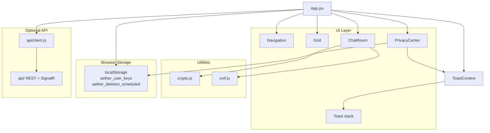
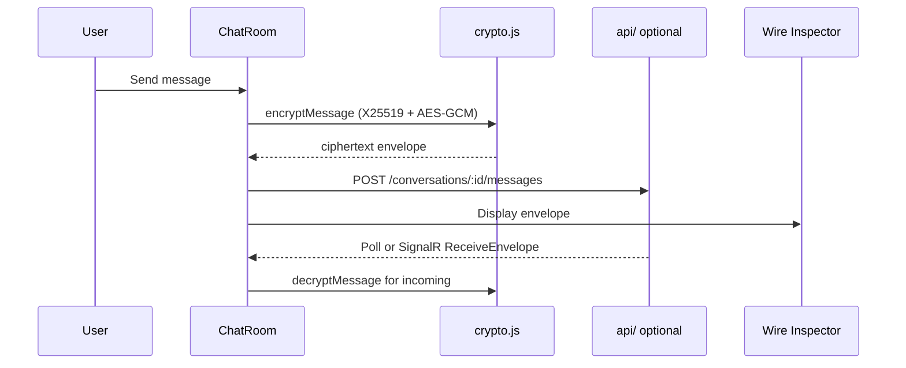

# Aether — Architecture

**Aether** is a single-page React application (Vite) with three primary surfaces: Discovery Grid, Encrypted Chats, and Privacy Centre. By default all state is client-side; when `VITE_API_URL` is set, profiles, keys, and ciphertext messages sync with [`api/`](../api/).

---

## High-level diagram


```mermaid
flowchart TB
  subgraph ui [UI Layer]
    Nav[Navigation]
    Grid[Grid]
    Chat[ChatRoom]
    Privacy[PrivacyCenter]
    Toast[Toast stack]
  end
  subgraph utils [Utilities]
    Crypto[crypto.js]
    Exif[exif.js]
  end
  subgraph storage [Browser Storage]
    LS["localStorage\naether_user_keys\naether_deletion_scheduled"]
  end
  subgraph api [Optional API]
    Client[api/client.js]
    Server[api/ REST + SignalR]
  end
  App[App.jsx] --> Nav
  App --> Client
  Client --> Server
  App --> Grid
  App --> Chat
  App --> Privacy
  App --> LS
  ToastCtx[ToastContext] --> Toast
  App --> ToastCtx
  Chat --> Crypto
  Chat --> Exif
  Privacy --> LS
  Privacy --> ToastCtx
```

---

## Tab routing

[`src/App.jsx`](../src/App.jsx) owns `currentTab`: `'grid' | 'chat' | 'privacy'`.

| UI label | `currentTab` | Component |
|----------|--------------|-----------|
| Discovery Grid (header) / **Grid** (bottom nav) | `grid` | `Grid` |
| Encrypted Chats (header) / **Chat** (bottom nav) | `chat` | `ChatRoom` |
| Privacy Centre (header) / **Security** (bottom nav) | `privacy` | `PrivacyCenter` |

Additional global flags: `stealthMode`, `activeChatProfile`, `startWithAlbum`, `currentUser.keys`.

---

## Component responsibilities

| Component | File | Role |
|-----------|------|------|
| **App** | `src/App.jsx` | Root state: tabs, stealth, mock `profiles`, user key ring, panic wipe, key rotation, Grid → Chat handoff |
| **Navigation** | `src/components/Navigation.jsx` | Header brand, desktop tab buttons, stealth toggle, panic confirm modal, mobile drawer |
| **Grid** | `src/components/Grid.jsx` | Profile cards, stealth banner, profile detail modal, routes to chat or secure album |
| **ChatRoom** | `src/components/ChatRoom.jsx` | Conversations, send/reply simulation, wire inspector, self-destruct, secure album, EXIF tools |
| **PrivacyCenter** | `src/components/PrivacyCenter.jsx` | Fuzzing strategy UI, key ring display, rotation trigger, PIN/shield toggles, deletion grace, device wipe |
| **Toast** | `src/components/Toast.jsx` + `src/context/ToastContext.jsx` | Non-blocking notifications and confirm prompts (replaces `alert` / `confirm`) |

Entry: [`src/main.jsx`](../src/main.jsx) wraps `App` in `ToastProvider` and mounts into `#root`.

---

## State and data

### Global (`App.jsx`)

| State | Purpose |
|-------|---------|
| `profiles` | Six mock discovery profiles (fuzzed distance strings, generative avatar colours) |
| `currentUser.keys` | Loaded from `aether_user_keys` or generated on mount |
| `stealthMode` | Invisible-mode banner; hides discovery grid when true |
| `albumScreenshotShield` | Album blur shield toggle (Privacy Centre → ChatRoom) |
| `activeChatProfile` / `startWithAlbum` | Set when opening chat from Grid |
| `currentTab` | Active main view |

### ChatRoom-local

| State | Purpose |
|-------|---------|
| `conversations` | Per-thread message arrays (plaintext in state) |
| `albumPhotos` | Ephemeral album mock entries |
| `lastTransmittedPacket` | Last encrypt output for wire inspector |
| `selectedChat`, `showAlbum`, `showWireInspector` | View routing inside Chat |
| EXIF / shield / self-destruct | Tool and timer UI state |

### PrivacyCenter-local

| State | Purpose |
|-------|---------|
| `fuzzingStrategy` | Radio selection only |
| `pinLockEnabled` | UI toggle (prototype stub) |
| `isDeleting`, `deletionTimer` | 30-day grace countdown from LS |

---

## Cross-component flows

### Grid → Chat

```text
Grid.onSelectChat(profile, openAlbum)
  → App.setActiveChatProfile(profile)
  → App.setStartWithAlbum(openAlbum)
  → App.setCurrentTab('chat')
  → ChatRoom useEffect selects thread / opens album
```

### Panic wipe

[`App.jsx`](../src/App.jsx) `handlePanicTrigger`:

1. `localStorage.removeItem('aether_user_keys')`
2. `localStorage.removeItem('aether_deletion_scheduled')`
3. `setStealthMode(true)`, clear chat profile routing
4. Generate new keys and write `aether_user_keys`
5. `setCurrentTab('grid')`

Triggered from Navigation panic button (after confirm) or Privacy Centre device wipe / expired deletion timer.

### Key lifecycle

```text
Mount → read aether_user_keys OR generateKeyPair → persist
Privacy Centre "Rotate Keys" → handleRotateKeys → setupNewKeys
Panic wipe → new generateKeyPair → persist
```

---

## Crypto message path (Web Crypto)


```mermaid
sequenceDiagram
  participant User
  participant ChatRoom
  participant Crypto as crypto.js
  participant API as api/ optional
  participant Inspector as Wire Inspector

  User->>ChatRoom: Send message
  ChatRoom->>Crypto: encryptMessage (X25519 + AES-GCM)
  Crypto-->>ChatRoom: ciphertext envelope
  ChatRoom->>API: POST /conversations/:id/messages
  ChatRoom->>Inspector: Display envelope
  API-->>ChatRoom: Poll or SignalR ReceiveEnvelope
  ChatRoom->>Crypto: decryptMessage for incoming
```

- 1:1: `encryptMessage(plaintext, privateKeyJwk, peerPublicKeyJwk)`; server stores ciphertext only.
- Group: `generateGroupKey` in client; group AES key not uploaded.
- Without API: local plaintext display + optional `simulatePartnerResponse`.

See [SECURITY.md](SECURITY.md).

---

## Styling system

[`src/index.css`](../src/index.css) is the single design-system file, organised in layers:

| Layer | Purpose | Examples |
|-------|---------|----------|
| **Tokens** | Colours, spacing, radii, shadows, z-index, motion durations | `--color-violet`, `--space-4`, `--duration-normal`, `--z-toast` |
| **Base** | Reset, typography, `:focus-visible`, Lucide icon sizing | `.icon-sm`, `.icon-md`, `.icon-lg` |
| **Utilities** | Layout helpers, scrollbars, pulse, skeleton | `.u-hidden`, `.u-md-flex`, `.custom-scrollbar`, `.u-animate-pulse`, `.skeleton` |
| **Components** | Semantic surface classes | `.profile-card`, `.chat-sidebar--hidden`, `.toast`, `.modal-body--centered` |

### Motion and accessibility

- Tab changes: `.main-content[data-tab]` fade (`data-tab` set in `App.jsx`).
- Grid cards: staggered `.profile-card-enter`; chat bubbles: `.message-enter`.
- Modals (Grid profile, Navigation panic): `useFocusTrap` + Escape to close; `scale-up` entry animation.
- `@media (prefers-reduced-motion: reduce)` disables pulse, shimmer, tab slide, and hover transforms.

### Toast notifications

- Provider: [`src/context/ToastContext.jsx`](../src/context/ToastContext.jsx) — `useToast().toast()` and `useToast().confirm()`.
- Rendered via portal-like fixed stack (`.toast-stack`, z-index `--z-toast`).
- Used for key rotation, panic wipe feedback, deletion scheduling, and device-wipe confirmation.

Component file headers document the class names each surface uses. Icons: `lucide-react` with `.icon-*` classes (no Tailwind).

[`src/App.css`](../src/App.css) is secondary; most UI is `index.css`.

---

## Extension points

Where a production backend would integrate:

| Concern | Current | Extension |
|---------|---------|-----------|
| Profiles | `MOCK_PROFILES` or `GET /profiles/nearby` | Implemented in `App.jsx` + `api/client.js` |
| Messages | `conversations` in `ChatRoom` | Ciphertext via REST; poll/SignalR receive |
| Keys | `localStorage` private JWK | Public JWK registered via `POST /keys/public` |
| Location fuzzing | Static `fuzzedDistance` strings | Server applies strategy from Privacy Centre preference |
| Deletion grace | LS timestamp + client countdown | Server-scheduled account purge job |

Keep [SECURITY.md](SECURITY.md) updated if `crypto.js` or `exif.js` behaviour changes.

Design criteria and plan-vs-built notes: [DESIGN.md](DESIGN.md). Documentation index: [README.md](README.md).
