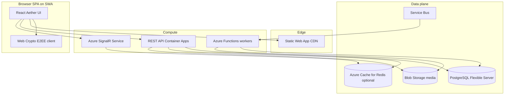

# Aether — Backend and Data Platform

The Aether SPA runs on **Azure Static Web Apps**. The **API, realtime gateway, background workers, and data stores** are separate Azure resources provisioned from [`infra/`](../infra/) and implemented in [`api/`](../api/).

See [DATA_MODEL.md](DATA_MODEL.md) for schema and store boundaries. See [SECURITY.md](SECURITY.md) for E2EE rules and operator visibility.

---

## Logical architecture



---

## E2EE boundary (non-negotiable)

| Data | Client | Server |
|------|--------|--------|
| Private keys | Device only (IndexedDB / secure storage) | **Never stored or transmitted** |
| Public keys | Generated locally, registered via API | Stored in PostgreSQL `device_public_keys` |
| Message plaintext | Decrypted in browser for display | **Never stored** |
| Message ciphertext | Encrypted before upload | Stored in PostgreSQL `messages` (MVP) |
| Raw GPS | Never sent | **Never stored** — only fuzzed distance bands |
| Album bytes | Optional client encryption before upload | Blob storage; metadata in PostgreSQL |

The server validates JWT identity, conversation membership, and envelope shape. It does **not** decrypt chat payloads.

---

## Services

| Service | Azure resource | Code location | Responsibility |
|---------|----------------|---------------|----------------|
| REST API | Container Apps | [`api/`](../api/) | Profiles, keys, messages, media SAS, account deletion |
| Realtime | SignalR Service | [`api/src/signalr/`](../api/src/signalr/) | Push ciphertext envelopes to conversation members |
| Purge worker | Functions + Service Bus | [`api/workers/purge/`](../api/workers/purge/) | Account deletion, media TTL cleanup |
| Auth | Microsoft Entra ID | [`api/src/middleware/auth.ts`](../api/src/middleware/auth.ts) | JWT validation (`Authorization: Bearer`) |

---

## API surface (`/api/v1`)

| Area | Endpoints | Auth |
|------|-----------|------|
| Profiles | `GET /profiles/nearby`, `GET /profiles/:id`, `PATCH /profiles/me` | JWT |
| Keys | `POST /keys/public`, `GET /keys/public/:userId`, `POST /keys/revoke` | JWT |
| Conversations | `GET /conversations`, `GET /conversations/:id/messages`, `POST /conversations/:id/messages` | JWT |
| Media | `POST /media/upload-sas`, `DELETE /media/:id` | JWT |
| Privacy | `PUT /preferences`, `POST /account/deletion`, `DELETE /account/deletion` | JWT |
| Support | `POST /support/error-reports` | JWT (rate-limited) |
| Admin | `GET /admin/error-reports`, `GET /admin/error-reports/:id`, `PATCH /admin/error-reports/:id` | JWT + admin |
| SignalR | `POST /signalr/negotiate`, hub `ReceiveEnvelope` | JWT |

### Error reports

`POST /api/v1/support/error-reports` accepts:

```json
{
  "description": "string (min 10 chars for manual reports)",
  "context": { "urlPath": "/#privacy", "userAgent": "..." },
  "source": "user | auto",
  "errorName": "TypeError",
  "stackSnippet": "optional truncated stack"
}
```

Context is allowlisted server-side (`deviceId`, `fingerprint`, `userAgent`, `urlPath`, `theme`, `accessibility`, `apiEnabled`, `appVersion`, `buildTime`). Keys matching `token`, `password`, `session`, `cipher`, or `message` are stripped.

Admin triage (no SPA UI yet):

- `GET /api/v1/admin/error-reports?status=new&source=auto&limit=50&cursor=ISO|uuid`
- `GET /api/v1/admin/error-reports/:id`
- `PATCH /api/v1/admin/error-reports/:id` with `{ "status": "triaged" | "resolved" }`

---

All write bodies for chat use ciphertext envelopes:

```json
{
  "ciphertext": "base64...",
  "cipherSuite": "ECDH-X25519-AES-256-GCM",
  "iv": "base64...",
  "keyId": "device-uuid",
  "expiresAt": "ISO-8601 | null"
}
```

---

## Environment configuration

| Variable | Used by | Purpose |
|----------|---------|---------|
| `DATABASE_URL` | API, workers | PostgreSQL connection string |
| `AZURE_AD_TENANT_ID` | API | Entra tenant for JWT issuer |
| `AZURE_AD_CLIENT_ID` | API | Expected audience / app registration |
| `AZURE_STORAGE_CONNECTION_STRING` | API | Blob SAS generation |
| `AZURE_SIGNALR_CONNECTION_STRING` | API | Realtime broadcast |
| `SERVICE_BUS_CONNECTION_STRING` | API, workers | Deletion queue |
| `DEV_AUTH_BYPASS` | API (dev only) | Accept `X-Dev-User-Id` when Entra is not configured |
| `SUPPORT_ALERT_EMAIL` | API | Recipient for new error-report email alerts (falls back to `ADMIN_EMAIL`) |
| `SMTP_*` | API | Required for password-reset and error-report alert emails in production |

Frontend: `VITE_API_URL` (e.g. `http://localhost:8080` or `https://api.example.com`).

API request logs include `requestId` (from `X-Request-Id` or generated) on every completed request for Log Analytics correlation. All log metadata is passed through `logSanitize.ts` so emails, user IDs, tokens, and query strings are not written to stdout.

---

## Phased delivery

| Phase | Backend | Frontend |
|-------|---------|----------|
| 1 | API + PostgreSQL profiles | `GET /profiles/nearby` replaces mock array |
| 2 | Entra JWT + public key registry | Keys synced to server; local private key only |
| 3 | Messages in PG + SignalR | `ChatRoom` send/receive ciphertext |
| 4 | Blob SAS + TTL lifecycle | Album upload after EXIF strip |
| 5 | Service Bus deletion worker | Deletion grace synced with server |

Optional later: Cosmos DB for messages at scale (`enable_cosmos` Terraform flag).

---

## Local development

```bash
# Start PostgreSQL (Docker)
docker run -d --name aether-pg -e POSTGRES_PASSWORD=aether -e POSTGRES_DB=aether -p 5432:5432 postgres:16

# API
cd api
npm install
npm run migrate
npm run dev

# SPA (separate terminal)
VITE_API_URL=http://localhost:8080 npm run dev
```

With `DEV_AUTH_BYPASS=true`, send header `X-Dev-User-Id: dev-user-1` instead of a JWT.

---

## Related docs

- [DATA_MODEL.md](DATA_MODEL.md) — ER diagram, tables, TTL policy
- [DEPLOYMENT.md](DEPLOYMENT.md) — Terraform apply, CI/CD, networking
- [ARCHITECTURE.md](ARCHITECTURE.md) — SPA component map
- [SECURITY.md](SECURITY.md) — Threat model with server metadata
