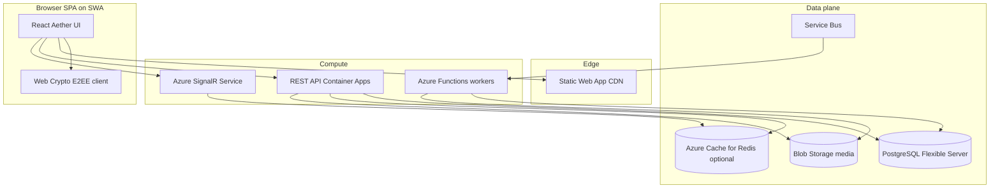

# Aether — Backend and Data Platform

The Aether SPA runs on **Azure Static Web Apps**. The **API, realtime gateway, background workers, and data stores** are separate Azure resources provisioned from [`infra/`](../infra/) and implemented in [`api/`](../api/).

See [SECURITY.md](SECURITY.md) for E2EE rules and operator visibility.

---

## Logical architecture



---

## E2EE boundary (non-negotiable)

| Data | Client | Server |
|------|--------|--------|
| Private keys | Device only (IndexedDB / secure storage) | **Never stored or transmitted** |
| Public keys | Generated locally, registered via API | Stored in PostgreSQL `device_public_keys` |
| Message plaintext | Decrypted in browser for display | **Never stored** |
| Message ciphertext | Encrypted before upload | Stored in PostgreSQL `messages` (MVP) |
| Raw GPS | Never sent | **Never stored** — only fuzzed distance bands |
| Album bytes | Optional client encryption before upload | Blob storage; metadata in PostgreSQL |

The server validates JWT identity, conversation membership, and envelope shape. It does **not** decrypt chat payloads.

---

## Services

| Service | Azure resource | Code location | Responsibility |
|---------|----------------|---------------|----------------|
| REST API | Container Apps | [`api/`](../api/) | Profiles, keys, messages, media SAS, account deletion |
| Realtime | SignalR Service | [`api/src/signalr/`](../api/src/signalr/) | Push ciphertext envelopes to conversation members |
| Purge worker | Functions + Service Bus | [`api/workers/purge/`](../api/workers/purge/) | Account deletion, media TTL cleanup |
| Auth | Microsoft Entra ID | [`api/src/middleware/auth.ts`](../api/src/middleware/auth.ts) | JWT validation (`Authorization: Bearer`) |

---

## API surface (`/api/v1`)

| Area | Endpoints | Auth |
|------|-----------|------|
| Profiles | `GET /profiles/nearby` (server-side discovery filters; see below), `GET /profiles/:id`, `PATCH /profiles/me` | JWT |
| Users | `GET/PATCH /users/me/messaging-preferences`, `GET/PATCH /users/me/discovery-preferences`, `GET/PATCH /users/me/privacy-preferences` | JWT |
| Config | `GET /config/mobile-links` | Public |
| Keys | `POST /keys/public`, `GET /keys/public/:userId`, `POST /keys/revoke` | JWT |
| Conversations | `GET /conversations`, `GET /conversations/:id/messages`, `POST /conversations/:id/messages` | JWT |
| Media | `POST /media/upload-sas`, `DELETE /media/:id` | JWT |
| Privacy | `PUT /preferences`, `GET /account/export`, `POST /account/deletion`, `DELETE /account/deletion`, `POST /account/panic` | JWT |
| Support | `POST /support/error-reports` | JWT (rate-limited) |
| Admin | `GET /admin/error-reports`, `GET /admin/error-reports/:id`, `PATCH /admin/error-reports/:id` | JWT + admin |
| SignalR | `POST /signalr/negotiate`, hub `ReceiveEnvelope` | JWT |

### Error reports

`POST /api/v1/support/error-reports` accepts:

```json
{
  "description": "string (min 10 chars for manual reports)",
  "context": { "urlPath": "/#privacy", "userAgent": "..." },
  "source": "user | auto",
  "errorName": "TypeError",
  "stackSnippet": "optional truncated stack"
}
```

Context is allowlisted server-side (`deviceId`, `fingerprint`, `userAgent`, `urlPath`, `theme`, `accessibility`, `apiEnabled`, `appVersion`, `buildTime`). Keys matching `token`, `password`, `session`, `cipher`, or `message` are stripped.

Admin triage (no SPA UI yet):

- `GET /api/v1/admin/error-reports?status=new&source=auto&limit=50&cursor=ISO|uuid`
- `GET /api/v1/admin/error-reports/:id`
- `PATCH /api/v1/admin/error-reports/:id` with `{ "status": "triaged" | "resolved" }`

---

### `GET /profiles/nearby`

Reads the authenticated viewer's saved `discovery_filters` from `user_preferences` and applies them in SQL (`discoveryFilterSql.ts`). Response:

```json
{
  "profiles": [ "...ProfileDto" ],
  "totalNearby": 6,
  "filtersActive": true
}
```

- `totalNearby` — discoverable count **before** discovery filters (for empty-state copy when filters exclude everyone).
- `filtersActive` — whether any discovery filter criterion is set.
- Display masking (`profile_view_prefs`) remains client-side only.

Filter rules are mirrored in `api/src/utils/discoveryFilterMatch.ts` and `src/utils/profileFilters.js`. Run `cd api && npm test`.

---

```json
{
  "ciphertext": "base64...",
  "cipherSuite": "ECDH-X25519-AES-256-GCM",
  "iv": "base64...",
  "keyId": "device-uuid",
  "expiresAt": "ISO-8601 | null"
}
```

---

## Environment configuration

| Variable | Used by | Purpose |
|----------|---------|---------|
| `DATABASE_URL` | API, workers | PostgreSQL connection string |
| `AZURE_AD_TENANT_ID` | API | Entra tenant for JWT issuer |
| `AZURE_AD_CLIENT_ID` | API | Expected audience / app registration |
| `AZURE_STORAGE_CONNECTION_STRING` | API | Blob SAS generation |
| `AZURE_SIGNALR_CONNECTION_STRING` | API | Realtime broadcast |
| `SERVICE_BUS_CONNECTION_STRING` | API, workers | Deletion queue |
| `DEV_AUTH_BYPASS` | API (dev only) | Accept `X-Dev-User-Id` when Entra is not configured |
| `SUPPORT_ALERT_EMAIL` | API | Recipient for new error-report email alerts (falls back to `ADMIN_EMAIL`) |
| `SMTP_*` | API | Required for password-reset and error-report alert emails in production |

Frontend: `VITE_API_URL` (e.g. `http://localhost:8080` or `https://api.example.com`).

API request logs include `requestId` (from `X-Request-Id` or generated) on every completed request for Log Analytics correlation. All log metadata is passed through `logSanitize.ts` so emails, user IDs, tokens, and query strings are not written to stdout.

---

## Phased delivery

| Phase | Backend | Frontend |
|-------|---------|----------|
| 1 | API + PostgreSQL profiles | `GET /profiles/nearby` replaces mock array |
| 2 | Entra JWT + public key registry | Keys synced to server; local private key only |
| 3 | Messages in PG + SignalR | `ChatRoom` send/receive ciphertext |
| 4 | Blob SAS + TTL lifecycle | Album upload after EXIF strip |
| 5 | Service Bus deletion worker | Deletion grace synced with server |

Optional later: Cosmos DB for messages at scale (`enable_cosmos` Terraform flag).

---

## Local development

```bash
# Start PostgreSQL (Docker)
docker run -d --name aether-pg -e POSTGRES_PASSWORD=aether -e POSTGRES_DB=aether -p 5432:5432 postgres:16

# API
cd api
npm install
npm run migrate
npm run dev

# SPA (separate terminal)
VITE_API_URL=http://localhost:8080 npm run dev
```

With `DEV_AUTH_BYPASS=true`, send header `X-Dev-User-Id: dev-user-1` instead of a JWT.

---

## Data model

PostgreSQL is the **system of record** for users, profiles, keys, messages (MVP), media metadata, and deletion schedules. Blob Storage holds encrypted album bytes. Optional Cosmos DB and Redis are gated by Terraform flags.

### Store boundaries

| Store | Holds | Must NOT hold |
|-------|-------|---------------|
| **PostgreSQL** | Users, profiles, prefs, public keys, message envelopes, media metadata, deletion requests | Private keys, plaintext messages, raw lat/long |
| **Blob Storage** | Encrypted JPEG/binary album objects | Public containers, long-lived SAS without expiry |
| **Redis** (optional) | Presence, rate limits, SignalR backplane | Durable compliance data |
| **Cosmos DB** (optional) | High-volume message documents at scale | Plaintext payloads |
| **Service Bus** | Deletion job messages (user id, scheduled time) | Message content |

### Entity relationship diagram

```mermaid
erDiagram
  users ||--o| profiles : has
  users ||--o{ user_preferences : has
  users ||--o{ device_public_keys : registers
  users ||--o{ deletion_requests : schedules
  users ||--o{ media_objects : owns
  users ||--o{ conversation_members : joins
  conversations ||--o{ conversation_members : contains
  conversations ||--o{ messages : contains
  users ||--o{ messages : sends

  users {
    uuid id PK
    text entra_oid UK
    text status
    timestamptz created_at
  }
  profiles {
    uuid user_id PK_FK
    text display_name
    text bio
    text role_label
    int age
    text gender
    jsonb looking_for
    text fuzzed_distance_label
    boolean discoverable
    jsonb avatar_colors
    jsonb tags
    boolean has_secure_album
  }
  user_preferences {
    uuid user_id PK_FK
    text fuzzing_strategy
    boolean album_shield_enabled
    jsonb discovery_filters
    jsonb profile_view_prefs
  }
  device_public_keys {
    uuid id PK
    uuid user_id FK
    text device_id
    jsonb public_key_jwk
    text fingerprint
    timestamptz revoked_at
  }
  conversations {
    uuid id PK
    boolean is_group
    text title
  }
  conversation_members {
    uuid conversation_id FK
    uuid user_id FK
  }
  messages {
    uuid id PK
    uuid conversation_id FK
    uuid sender_user_id FK
    text ciphertext
    text cipher_suite
    text iv
    text key_id
    timestamptz sent_at
    timestamptz expires_at
  }
  media_objects {
    uuid id PK
    uuid owner_id FK
    text blob_path
    text content_type
    timestamptz expires_at
  }
  deletion_requests {
    uuid id PK
    uuid user_id FK
    timestamptz scheduled_purge_at
    timestamptz cancelled_at
  }
```

### Table reference

#### `users`

| Column | Type | Notes |
|--------|------|-------|
| `id` | UUID | Primary key |
| `entra_oid` | TEXT | Unique Entra object id; dev bypass uses synthetic ids |
| `status` | TEXT | `active`, `deletion_pending`, `locked`, `purged` |
| `created_at` | TIMESTAMPTZ | Account creation |

#### `profiles`

Discovery responses expose **fuzzed_distance_label** only — never raw coordinates. Server computes label from internal geo + `user_preferences.fuzzing_strategy`.

| Column | Type | Notes |
|--------|------|-------|
| `gender` | TEXT | One of: `male`, `female`, `non-binary`, `trans-man`, `trans-woman`, `agender`, `genderqueer`, `prefer-not-to-say` |
| `looking_for` | JSONB | Array of string labels (e.g. `Chats`, `Friends`, `Dating`) |

#### `user_preferences`

| Column | Type | Notes |
|--------|------|-------|
| `discovery_filters` | JSONB | Optional `ageMin`, `ageMax`, `genders[]`, `interests[]`, `interestMatch` (`any` \| `all`); empty object = no filter |
| `profile_view_prefs` | JSONB | Booleans: `showAge`, `showGender`, `showInterests`, `showLookingFor` (default all true) |
| `fuzzing_strategy` | TEXT | `grid_snap`, `jitter`, or `distance_only` — persisted via `GET/PATCH /users/me/privacy-preferences` |
| `album_shield_enabled` | BOOLEAN | Screenshot blur for native private albums (default true) |

Client-side filtering applies `discovery_filters` to nearby profiles in demo mode only. With the API enabled, `GET /profiles/nearby` applies the viewer's saved filters in SQL and returns `{ profiles, totalNearby }`.

#### `device_public_keys`

Only **public** JWK material. `revoked_at` set on key rotation or panic wipe sync.

#### `messages`

MVP stores ciphertext in PostgreSQL. `expires_at` enables self-destruct; a scheduled job deletes expired rows.

Envelope fields match client [`crypto.js`](../src/utils/crypto.js) output: `ciphertext`, `iv`, `cipherSuite`, `keyId`.

#### `media_objects`

`blob_path` references private container. `expires_at` aligns with Blob lifecycle policy (default 7 days dev, configurable prod).

#### `deletion_requests`

30-day grace period. Worker consumes Service Bus message at `scheduled_purge_at`, deletes PG rows, blobs, and revokes keys.

### Cosmos DB (optional, `enable_cosmos = true`)

When enabled, new messages may be written to Cosmos instead of PostgreSQL.

| Field | Purpose |
|-------|---------|
| Partition key | `/conversationId` |
| `id` | Message UUID |
| `ttl` | Seconds until auto-delete (ephemeral messages) |

Migration from PostgreSQL to Cosmos is a Phase 6 optional task.

### Redis keys (optional, `enable_redis = true`)

| Key pattern | TTL | Purpose |
|-------------|-----|---------|
| `presence:{userId}` | 120s | Online / discoverable heartbeat |
| `ratelimit:{ip}` | 60s | API rate limiting |
| `session:{sessionId}` | configurable | Auth session cache |

### Indexing

| Table | Index | Reason |
|-------|-------|--------|
| `profiles` | `(discoverable, age, gender)` partial where discoverable | Discovery filter queries (`010_discovery_filter_index.sql`) |
| `messages` | `(conversation_id, sent_at DESC)` | Thread pagination |
| `device_public_keys` | `(user_id)` where `revoked_at IS NULL` | Active key lookup |
| `media_objects` | `(expires_at)` | TTL purge scans |

### Data verification checklist

1. API responses contain fuzzed distance labels — no raw lat/long.
2. Database inspection shows no private keys or message plaintext.
3. Deletion worker removes PG rows, blobs, and keys for the user.
4. SignalR delivers envelopes only to authorised conversation members.
5. Panic wipe + server revoke prevents re-registration of old device keys.

---

## Related docs

- [DEPLOYMENT.md](DEPLOYMENT.md) — Terraform apply, CI/CD, networking
- [ARCHITECTURE.md](ARCHITECTURE.md) — SPA component map
- [SECURITY.md](SECURITY.md) — Threat model with server metadata
