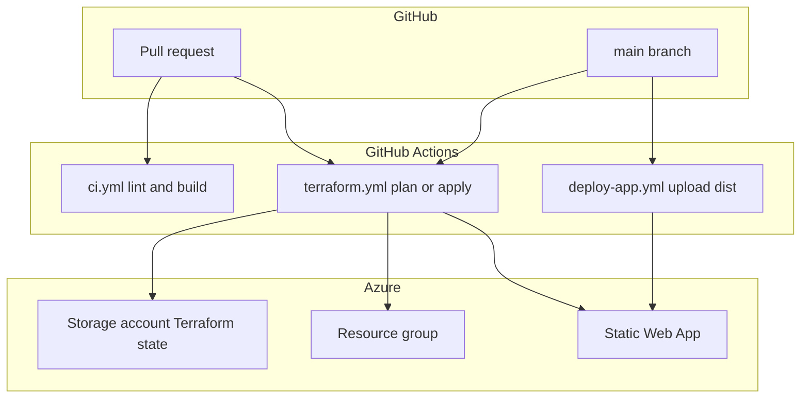

# Deployment — Azure Static Web Apps

This document describes how **Aether** (client-only React + Vite) is hosted on **Azure Static Web Apps (SWA)** with **Terraform** infrastructure and **GitHub Actions** CI/CD.

> **Backend optional** — SWA hosts the SPA. Enable `enable_backend` in Terraform to provision PostgreSQL, Container Apps API, SignalR, Service Bus, and storage. See [BACKEND.md](BACKEND.md).

---

## Architecture



| Workflow | Trigger | Auth | Purpose |
|----------|---------|------|---------|
| `ci.yml` | PR + push to `main` | None | Lint, build, upload `dist` artifact |
| `terraform.yml` | PR/push when `infra/**` changes | Azure OIDC | Plan (PR) / apply (`main`) |
| `deploy-app.yml` | Push to `main` (app paths) | SWA deployment token | Build and publish `dist/` |

---

## Prerequisites

- Azure subscription with permission to create resource groups and Static Web Apps
- GitHub repository with Actions enabled
- Local tools for bootstrap: [Azure CLI](https://learn.microsoft.com/cli/azure/install-azure-cli), [Terraform](https://developer.hashicorp.com/terraform/install) >= 1.5, [GitHub CLI](https://cli.github.com/) (optional)

---

## One-time bootstrap

Detailed steps live in [infra/README.md](../infra/README.md). Summary:

### 1. Terraform remote state

Run the bootstrap script to create a dedicated resource group, storage account, and `tfstate` container:

```bash
export PROJECT_NAME=aether
export LOCATION=newzealandnorth
./infra/bootstrap/bootstrap-state.sh
```

Copy [infra/backend.hcl.example](../infra/backend.hcl.example) to `infra/backend.hcl` and paste the values from the script output. Use a **separate state key per environment** (e.g. `aether-dev.terraform.tfstate`, `aether-prod.terraform.tfstate`).

### 2. Entra ID OIDC (Terraform workflow)

```bash
export GITHUB_ORG=your-org
export GITHUB_REPO=your-repo
export PROJECT_NAME=aether
./infra/bootstrap/setup-oidc.sh
```

Creates federated credentials for:

- `repo:ORG/REPO:pull_request` — Terraform plan on PRs
- `repo:ORG/REPO:ref:refs/heads/main` — Terraform apply on `main`

### 3. GitHub repository configuration

**Variables** (Settings → Secrets and variables → Actions → Variables):

| Variable | Set by | Example |
|----------|--------|---------|
| `AZURE_CLIENT_ID` | OIDC bootstrap | Entra app client ID |
| `AZURE_TENANT_ID` | OIDC bootstrap | Tenant GUID |
| `AZURE_SUBSCRIPTION_ID` | OIDC bootstrap | Subscription GUID |
| `TFSTATE_RESOURCE_GROUP` | Manual (from bootstrap) | `rg-aether-tfstate` |
| `TFSTATE_STORAGE_ACCOUNT` | Manual (from bootstrap) | `staethertfabc12345` |
| `TFSTATE_CONTAINER` | Manual | `tfstate` |
| `TF_PROJECT_NAME` | Manual | `aether` |

**Secrets:**

| Secret | Source |
|--------|--------|
| `AZURE_STATIC_WEB_APPS_API_TOKEN` | `terraform output -raw static_web_app_api_key` after first apply |

**Environments** (optional): create `development` and `production` environments in GitHub. The Terraform apply job uses `production` when dispatching with `prod` tfvars for approval gating.

### 4. First infrastructure apply

```bash
cd infra
terraform init -backend-config=backend.hcl
terraform apply -var-file=environments/dev.tfvars
terraform output static_web_app_default_hostname
terraform output -raw static_web_app_api_key   # → GitHub secret
```

Push to `main` or run **Deploy app** workflow manually to publish the first build.

---

## Day-to-day deploy

1. Merge application changes to `main` → `deploy-app.yml` runs `npm ci`, `npm run build`, uploads `dist/` to SWA.
2. Merge infrastructure changes under `infra/` → `terraform.yml` plans on PR, applies on `main`.
3. PRs always run `ci.yml` (lint + build).

Local build matches CI:

```bash
npm run build   # output: dist/
```

SPA routing and security headers are configured in [public/staticwebapp.config.json](../public/staticwebapp.config.json) (copied into `dist/` by Vite).

---

## Environments

| Environment | tfvars | SWA SKU (default) | Deploy trigger |
|-------------|--------|-------------------|----------------|
| **dev** | `infra/environments/dev.tfvars` | Free | Auto on `main` |
| **prod** | `infra/environments/prod.tfvars` | Standard | `workflow_dispatch` with `prod` + GitHub `production` environment |

For a demo prototype, **dev only** is sufficient; keep `prod.tfvars` for later.

---

## Rollback

| Scenario | Action |
|----------|--------|
| Bad app deploy | Re-run **Deploy app** from a known-good commit on `main`, or redeploy a previous workflow run artifact |
| Bad infra change | `git revert` the Terraform change, merge to `main`, let apply run; or `terraform apply` previous state locally |
| Leaked SWA token | Re-apply Terraform (regenerates API key) or rotate in Azure Portal → update `AZURE_STATIC_WEB_APPS_API_TOKEN` |

---

## Secret rotation

| Credential | Rotation |
|------------|----------|
| SWA deployment token | `terraform apply` and update GitHub secret from `static_web_app_api_key` output |
| OIDC app registration | Add new federated credential before removing old; no long-lived client secret is stored |
| Terraform state | Storage account keys — use Azure RBAC (`Storage Blob Data Contributor`) for OIDC-based state access in CI |

---

## Verification checklist

| # | Check |
|---|--------|
| 1 | `terraform plan -var-file=environments/dev.tfvars` succeeds |
| 2 | `terraform apply` creates SWA; hostname resolves over HTTPS |
| 3 | `ci.yml` passes on PR |
| 4 | `deploy-app.yml` publishes `dist/`; Grid loads at SWA URL |
| 5 | Deep link refresh works (`navigationFallback` in `staticwebapp.config.json`) |
| 6 | Response includes `X-Content-Type-Options` and `Referrer-Policy` headers |

---

## Backend platform (`enable_backend`)

Set in `infra/environments/*.tfvars`:

| Variable | dev | prod |
|----------|-----|------|
| `enable_backend` | `true` in `dev.tfvars` (requires `TF_VAR_postgres_admin_password`) | `true` |
| `enable_redis` | `false` | `true` |
| `enable_cosmos` | `false` | `false` (optional) |
| `postgres_admin_password` | TF_VAR in CI | Required, min 12 chars |

Terraform modules under `infra/modules/`:

- **data** — Key Vault, PostgreSQL, Storage; optional Cosmos, Redis
- **compute** — Container Apps API, Functions workers, SignalR
- **messaging** — Service Bus deletion queue

Outputs after apply: `api_fqdn`, `postgresql_fqdn`, `key_vault_uri`, `signalr_hostname`.

Configure Container App env vars from Key Vault: `DATABASE_URL`, `AZURE_SIGNALR_CONNECTION_STRING`, `AZURE_STORAGE_CONNECTION_STRING`, `SERVICE_BUS_CONNECTION_STRING`, Entra `AZURE_AD_*`.

Point the SPA at the API: `VITE_API_URL=https://<api_fqdn>` in the deploy workflow or SWA application settings.

---

## Demo-only deploy (Phase 1 — no backend)

Use this when you only need a shareable HTTPS demo with **no** PostgreSQL or Container Apps cost.

1. Apply Terraform with `enable_backend = false` in your tfvars (or use defaults before enabling backend in `dev.tfvars`).
2. Store `static_web_app_api_key` output as GitHub secret `AZURE_STATIC_WEB_APPS_API_TOKEN`.
3. Push to `main` — `deploy-app.yml` builds and uploads `dist/` (leave `VITE_API_URL` unset for demo mode).
4. Verify the SWA URL shows the **Demo mode** banner and mock profiles.
5. Confirm response headers include CSP, `Permissions-Policy`, and `X-Frame-Options` via browser devtools or `curl -I`.

Optional: add `public/favicon.svg` is bundled automatically from `public/`.

---

## Full stack deploy (Phase 2)

1. Set `TF_VAR_postgres_admin_password` and apply Terraform with `enable_backend = true`.
2. Note outputs: `api_url`, `container_registry_login_server`, `static_web_app_url`.
3. Configure GitHub secrets for `deploy-api.yml`: `ACR_NAME`, `ACR_LOGIN_SERVER`, `CONTAINER_APP_NAME`, `AZURE_RESOURCE_GROUP`, plus Azure OIDC vars.
4. Set repository variable `VITE_API_URL` to the `api_url` output for `deploy-app.yml`.
5. Push API changes — `deploy-api.yml` builds Docker image, pushes to ACR, updates Container App (migrations run on container start).

---

## Related docs

- [infra/README.md](../infra/README.md) — Terraform layout and bootstrap scripts
- [BACKEND.md](BACKEND.md) — API catalogue and E2EE boundaries
- [DATA_MODEL.md](DATA_MODEL.md) — PostgreSQL schema
- [DEVELOPMENT.md](DEVELOPMENT.md) — Local API + SPA development
- [ARCHITECTURE.md](ARCHITECTURE.md) — Application architecture
