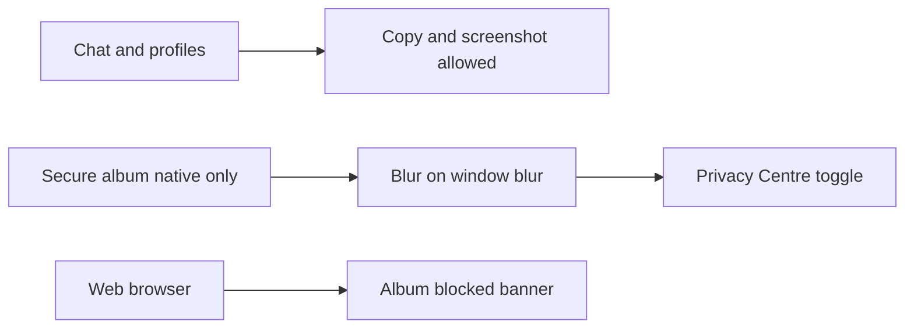

# Aether — Design Principles

Product intent and design criteria for the **Aether** privacy-first dating prototype. For component layout see [ARCHITECTURE.md](ARCHITECTURE.md); for security boundaries see [SECURITY.md](SECURITY.md).

---

## Design criteria

These five criteria govern UX copy and what the prototype must demonstrate:

1. **No real location maps** — The grid shows fuzzed distance bands only ("Nearby", "Within 5 km"). There are no map tiles, GPS pins, or precise coordinates in the UI.
2. **Screenshot policy split** — Secure ephemeral albums blur when the browser loses focus (and when the Privacy Centre shield toggle is on) on the **native app**. Regular chat threads and profile modals remain copyable; there is no chat-wide screenshot block. **Private albums are not available on web** — users see a banner and album uploads are rejected server-side.
3. **Panic vs deletion** — **Panic wipe** clears local storage immediately and enables stealth. **Account deletion** is a separate 30-day server grace period with countdown and cancel — simulated via `localStorage` in this prototype.
4. **Invisible mode** — Stealth mode hides the discovery grid so nearby users cannot browse or open your profile card until visibility is restored.
5. **Documented CSS** — Styling lives in [`src/index.css`](../src/index.css) with semantic class names and comments (not Tailwind).

---

## Screenshot policy

```mermaid
flowchart LR
  ChatUI[Chat and profiles] --> AllowCopy[Copy and screenshot allowed]
  AlbumUI[Secure album native only] --> Shield[Blur on window blur]
  WebUI[Web browser] --> BlockAlbum[Album blocked banner]
  Shield --> Toggle[Privacy Centre toggle]
```

| Surface | Screenshot / copy | Shield / access |
|---------|-------------------|-----------------|
| 1:1 and group chat bubbles | Allowed | — |
| Profile modal (Grid) | Allowed | — |
| Secure ephemeral album | Native app only | Blur on defocus when shield enabled; `albumScreenshotShield` in `App.jsx` → `ChatRoom` |
| Web browser | Album view/upload blocked | `WebAlbumBlockedBanner`; API 403 on album SAS when `X-Aether-Client: web` |

---

## Plan vs built

Early planning assumed Tailwind and Web Crypto API keys. The shipped prototype differs as follows:

| Planned (implementation plan) | Actual |
|-------------------------------|--------|
| Tailwind + PostCSS | **Vanilla CSS** in `src/index.css` |
| Web Crypto API for keys | **Simulated** keys + XOR-style cipher in `crypto.js` |
| IndexedDB for panic cache | **`localStorage` only** (`aether_user_keys`, `aether_deletion_scheduled`) |
| Chat persistence across reload | React state in `ChatRoom` — **lost on full page reload** |
| Stealth hides grid | **Implemented** — empty state when `stealthMode` |
| Album shield wired to Privacy Centre | **Implemented** — lifted to `App.jsx` |

---

## Feature → implementation map

| Feature | Primary code | Notes |
|---------|--------------|-------|
| Discovery grid | `Grid.jsx`, profiles in `App.jsx` | Six mock profiles; client-side discovery filters |
| Location fuzzing UI | `PrivacyCenter.jsx` | Strategy radios — UI state only |
| Discovery filters | `PrivacyCenter.jsx`, `Grid.jsx`, `profileFilters.js` | Age/gender/interest filters; display toggles |
| Presence / stealth | `Navigation.jsx`, `App.jsx`, `Grid.jsx` | Grid hidden when stealth on |
| E2EE + wire inspector | `ChatRoom.jsx`, `crypto.js` | Simulated cipher |
| Ephemeral album + EXIF | `ChatRoom.jsx`, `exif.js` | Real JPEG APP1 strip; shield on blur |
| Panic + 30-day deletion | `App.jsx`, `PrivacyCenter.jsx` | `localStorage` + client countdown |
| Responsive layout | `index.css` | Desktop split panes; mobile bottom nav &lt; 768px |

---

## Documentation index

See [README.md](README.md) for the full map. Key documents:

| Doc | Topic |
|-----|--------|
| [README.md](../README.md) | Quick start, feature overview |
| [project-summary.md](project-summary.md) | Executive summary and architecture overview |
| [FEATURES.md](FEATURES.md) | Feature catalogue and 5-minute demo |
| [ARCHITECTURE.md](ARCHITECTURE.md) | Components, state, flows |
| [SECURITY.md](SECURITY.md) | Simulated vs real behaviour |
| [DEVELOPMENT.md](DEVELOPMENT.md) | Scripts, verification checklist |
