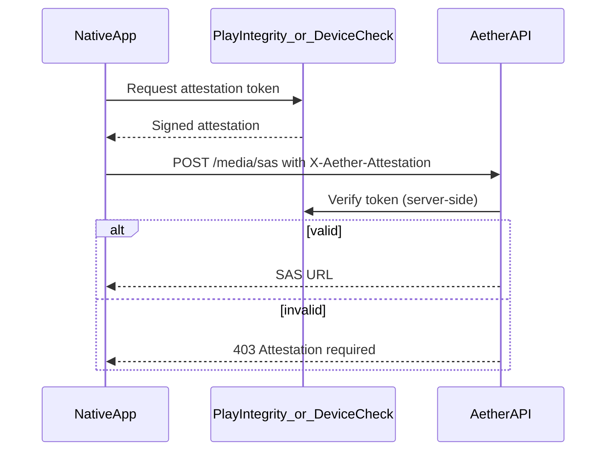

# Native app attestation for album upload policy

Album media uploads are restricted to native clients (`X-Aether-Client: native`) because web sessions cannot yet prove device integrity. Today the header is **trust-on-first-use** and spoofable. This document defines the target attestation model.

Related: [SECURITY_ARCHITECTURE.md](SECURITY_ARCHITECTURE.md), `api/src/middleware/clientPlatform.ts`.

---

## Current behaviour

| Client | Header | Album upload |
|--------|--------|--------------|
| Browser | `web` | **Blocked** (403) |
| Capacitor shell | `native` | Allowed (header only) |

Implementation: `assertAlbumUploadAllowed()` in `api/src/middleware/clientPlatform.ts`.

---

## Threat model

| Attacker | Goal | Current gap |
|----------|------|-------------|
| Web user | Upload album from browser | Blocked by header check |
| Web user with custom client | Spoof `native` header | **Allowed today** — gap |
| Repackaged APK/IPA | Upload without store signing | Mitigated by store distribution + future cert pinning |
| Emulator / rooted device | Automated abuse | Partially addressed by attestation |

Attestation proves the request originates from an **unmodified store build** on a **genuine device** (policy-configurable strictness).

---

## Target architecture

### Android — Play Integrity API

1. Capacitor plugin (or native module) calls `IntegrityManager.requestIntegrityToken()`.
2. Include `requestHash` binding nonce issued by API (`GET /api/v1/config` returns short-lived `attestationNonce`).
3. Client sends token in `X-Aether-Attestation` header on album SAS requests.
4. API verifies via Google Play Integrity REST API using service account credentials stored in Key Vault.

**Verdict checks:**

- `appRecognitionVerdict`: `PLAY_RECOGNIZED`
- `deviceIntegrity`: `MEETS_DEVICE_INTEGRITY` (or `MEETS_BASIC_INTEGRITY` for relaxed staging)
- Package name matches production bundle ID

### iOS — DeviceCheck / App Attest

1. Use `DCAppAttestService` to generate key and attestation object.
2. Bind API-issued nonce in client data hash.
3. Send assertion on each album upload request (or cache short-lived server session after first attestation).
4. API verifies with Apple's App Attest API.

**Checks:**

- App ID matches production bundle
- Assertion fresh (nonce not reused)

---

## API changes (future implementation)

| Endpoint | Change |
|----------|--------|
| `GET /api/v1/config` | Add `attestationNonce` (TTL 5 min, single use) |
| `POST /api/v1/media/sas` | Require valid `X-Aether-Attestation` when `purpose=album` |
| Container App env | `GOOGLE_PLAY_INTEGRITY_*`, `APPLE_APP_ATTEST_*` from Key Vault |

Phased rollout:

1. **Observe** — log attestation header presence without enforcing (staging).
2. **Enforce native + attestation** — reject album SAS without valid token (prod).
3. **Optional session** — after first attestation, issue 24h `attestationSession` JWT to reduce store API calls.

---

## Environment policy

| Environment | Enforcement |
|-------------|-------------|
| Dev | Header check only; attestation optional / mocked |
| Staging | Attestation required for album uploads; relaxed device integrity |
| Prod | Full integrity checks; nonce binding required |

---

## Client implementation notes

- Add attestation call to Capacitor plugin layer (`mobile/android`, `mobile/ios`).
- Refresh attestation before SAS request if token age > 5 minutes.
- On attestation failure, show user-facing message: album uploads require the official app from the store.
- Web remains blocked regardless of attestation.

---

## Out of scope (MVP)

- Certificate pinning (optional hardening — document tradeoffs: breaks debug builds)
- Jailbreak/root detection beyond store attestation APIs
- Profile photo upload attestation (web allowed for profile avatars)

---

## Acceptance criteria (when implemented)

- [ ] Spoofed `X-Aether-Client: native` without attestation → 403 on album SAS
- [ ] Valid store build with attestation → 200
- [ ] Nonce replay rejected
- [ ] Staging E2E test with mocked attestation provider
