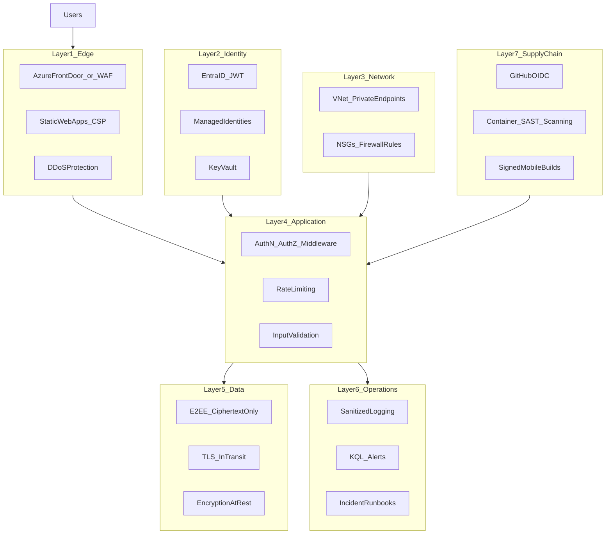
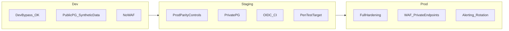
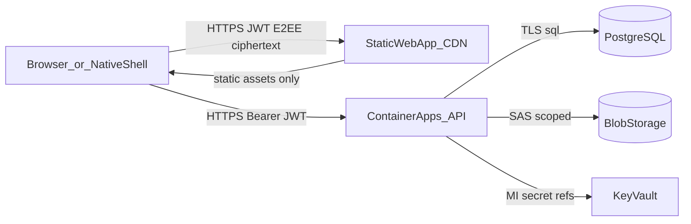

# Security architecture

Aether uses a **defence-in-depth** model across seven layers. This document describes controls, environment tiers, trust boundaries, data classification, and known tradeoffs.

Related docs: [SECURITY.md](SECURITY.md), [SECURITY_REVIEW.md](SECURITY_REVIEW.md), [COMPLIANCE.md](COMPLIANCE.md), [OPERATIONS.md](OPERATIONS.md), [NATIVE_ATTESTATION.md](NATIVE_ATTESTATION.md).

---

## Layer model

| Layer | Purpose | Primary controls |
|-------|---------|------------------|
| 1 — Edge | Perimeter, TLS termination, abuse filtering | SWA CSP, API security headers (`helmet`), Front Door + WAF (prod) |
| 2 — Identity | Who can access what | Entra JWT, app session JWT, Key Vault, managed identities |
| 3 — Network | Isolate data plane | Private endpoints, VNet-integrated Container Apps (staging/prod) |
| 4 — Application | Enforce policy in code | `requireAuth`, locked-account checks, rate limits, CORS |
| 5 — Data | Protect data at rest and in transit | E2EE ciphertext-only, PostgreSQL TLS, blob SAS TTL |
| 6 — Operations | Detect and respond | Sanitized logs, KQL alerts, incident runbook |
| 7 — Supply chain | Safe build and deploy | GitHub OIDC, pinned actions, container scanning |

---

## Environment tiers

| Dimension | Dev | Staging | Prod |
|-----------|-----|---------|------|
| Real user PII | **Never** | Synthetic / team only | Yes |
| `DEV_AUTH_BYPASS` | `true` (optional) | `false` | `false` |
| Entra ID | Optional | Required | Required |
| Network | Public PG + IP firewall | Private PG, VNet start | Full private endpoints |
| WAF | None | Optional | Required before public beta |
| Rate limiting | In-memory | Redis | Redis + edge |
| Secret injection | `.env` / TF | KV references + MI | KV + MI, no secrets in TF state |
| Monitoring alerts | None | Basic 5xx | Full suite |

Terraform tfvars: `infra/environments/dev.tfvars`, `staging.tfvars`, `prod.tfvars`.

---

## Trust boundaries

| Boundary | Trust level | Notes |
|----------|-------------|-------|
| Browser ↔ SWA | Semi-trusted | CSP limits script injection; assets are public |
| Browser ↔ API | Authenticated | JWT validated per request; CORS single origin |
| API ↔ PostgreSQL | High trust (private network in staging/prod) | Connection string from Key Vault |
| API ↔ Blob | Scoped SAS | 15-minute default TTL; lifecycle deletion |
| Device ↔ E2EE | User-controlled | Private keys never cross boundary to server |

Operators must treat Log Analytics and support inboxes as **internal** trust zones — logs are sanitized; support emails may contain user-authored content.

---

## Data classification

| Class | Examples | Storage | Server can read plaintext? |
|-------|----------|---------|----------------------------|
| Public | Static assets, public key JWKs | SWA / PostgreSQL | Yes (keys are public by design) |
| Internal | Request IDs, HTTP metrics | Log Analytics | N/A (no PII by policy) |
| Sensitive | Email, profile text, fuzzed distance | PostgreSQL | Yes |
| E2EE | Message ciphertext, encrypted backups | PostgreSQL / user device | **No** (without device keys) |

GDPR export (`GET /api/v1/account/export`) returns server-held personal data including ciphertext; decryption requires the user's device keys or backup passphrase.

---

## Control ownership

| Area | Owner | Examples |
|------|-------|----------|
| Application security | App team | Auth middleware, rate limits, input validation |
| Infrastructure | Platform / infra | Terraform modules, VNet, WAF, Key Vault |
| Operations | On-call / ops | Alerts, rotation drills, incident response |
| Client crypto | App team | Web Crypto, key storage, chat backup |
| Compliance | Product + legal | Age gate, privacy policy, data export |

---

## Known tradeoffs (accepted for MVP)

| Tradeoff | Risk | Mitigation |
|----------|------|------------|
| JWT in `localStorage` | XSS can steal session | Strict CSP on SWA; no inline scripts; sanitized logging |
| No forward secrecy (single long-lived device key) | Key compromise reveals past messages | Documented in [SECURITY.md](SECURITY.md); future double-ratchet |
| `X-Aether-Client: native` header | Spoofable until attestation | Album upload blocked on web; attestation spec in [NATIVE_ATTESTATION.md](NATIVE_ATTESTATION.md) |
| httpOnly cookie sessions deferred | Same XSS surface as JWT | Planned post-MVP refactor |
| WebAuthn / MFA | Not yet implemented | Documented future phase |

---

## Implementation status

See [SECURITY_REVIEW.md](SECURITY_REVIEW.md) for Pass / Gap / Verify per control. Phase deliverables:

- **Phase 0** — This document + [OPERATIONS.md](OPERATIONS.md)
- **Phase 1** — App hardening (`helmet`, locked accounts, Redis rate limits, admin cleanup)
- **Phase 2** — KV secret refs, ACR managed identity, staging tfvars
- **Phase 3** — `infra/modules/network/` private endpoints
- **Phase 4** — `infra/modules/edge/` Front Door + WAF
- **Phase 5** — CI tests, audit, container scan
- **Phase 7** — [SECURITY_REVIEW.md](SECURITY_REVIEW.md)
