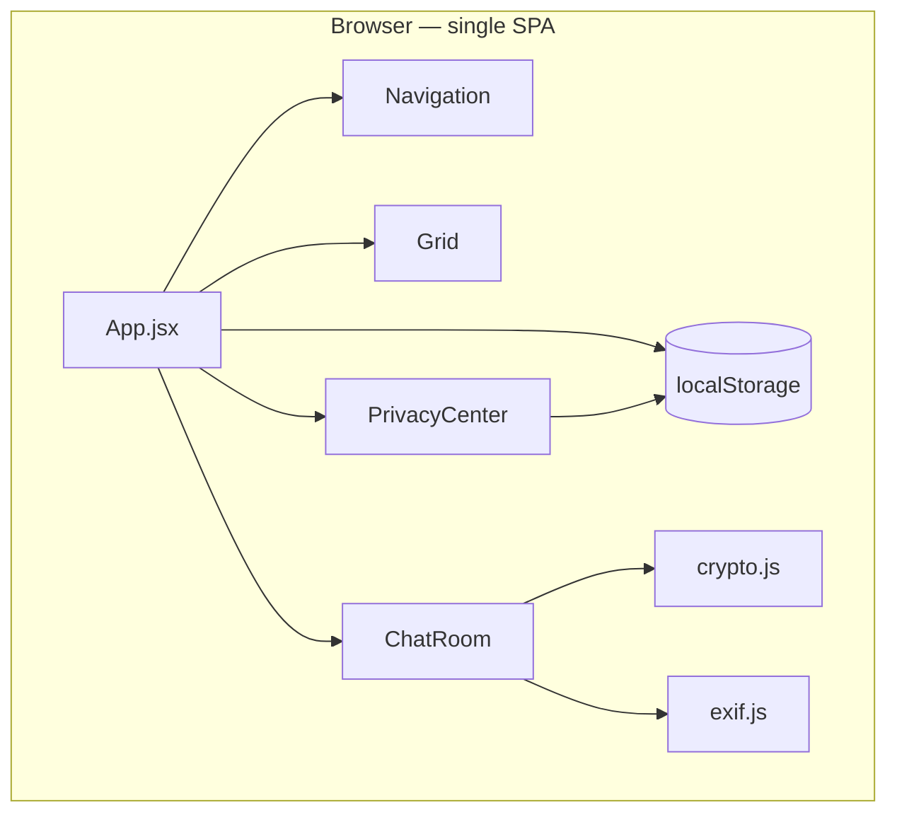
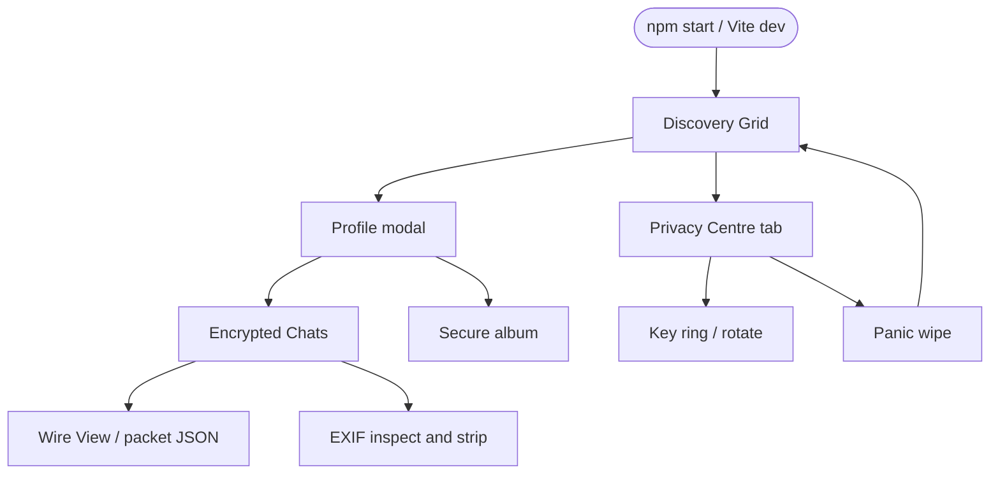

# Aether — Project Summary

## Executive summary

**Aether** is a browser-only React prototype that demonstrates a privacy-oriented dating grid: fuzzed distance discovery, simulated end-to-end encrypted chat, EXIF stripping on JPEGs, and a privacy centre for keys, stealth mode, and panic wipe. The app runs entirely in the client with mock profiles and conversations; cryptography and location controls are educational simulations, not production security.

Repository folder: `optimistic-pasteur`. Product name in UI: **Aether**.

## Architecture overview



There is **no server**, message queue, or database. Chat history lives in React state and is lost on full page reload except for keys and deletion scheduling in `localStorage`.

## Processing flow (user journey)



## Core components

| Component | File | Responsibility |
|-----------|------|----------------|
| App | `src/App.jsx` | Tab routing, mock `profiles`, key lifecycle, panic wipe, Grid → Chat handoff |
| Navigation | `src/components/Navigation.jsx` | Header tabs, stealth toggle, panic confirm modal, mobile drawer |
| Grid | `src/components/Grid.jsx` | Profile cards, stealth empty state, profile modal |
| ChatRoom | `src/components/ChatRoom.jsx` | Conversations, wire inspector, album, EXIF tools, self-destruct |
| PrivacyCenter | `src/components/PrivacyCenter.jsx` | Fuzzing UI, key display, shields, deletion grace |
| crypto.js | `src/utils/crypto.js` | Simulated key pair and encrypt/decrypt packets |
| exif.js | `src/utils/exif.js` | JPEG APP1 inspect and strip (client-side) |

## Persistence and contracts

| Key / artefact | Storage | Purpose |
|----------------|---------|---------|
| `aether_user_keys` | `localStorage` | Public/private key strings and fingerprint |
| `aether_deletion_scheduled` | `localStorage` | ISO timestamp for 30-day deletion grace UI |
| `conversations` | React state in `ChatRoom` | Message threads (not persisted) |
| `profiles` | React state in `App.jsx` | Six mock discovery profiles |

Wire packets are JSON objects built on send and shown in the **Wire View** panel; they do not traverse a network.

## Infrastructure and deployment

| Item | Detail |
|------|--------|
| Runtime | Node.js 18+ for build/dev only |
| Build | `npm run build` → static `dist/` |
| Hosting | Any static file host (S3, Netlify, GitHub Pages, etc.) |
| CI | Not configured in this repository |
| Containers | No `Dockerfile` |

## Extension patterns

1. **Add a mock profile** — Append to `profiles` in `src/App.jsx`; optionally seed `conversations` in `ChatRoom.jsx`.
2. **Change crypto or EXIF behaviour** — Edit `src/utils/crypto.js` or `src/utils/exif.js`; update [SECURITY.md](SECURITY.md) and [FEATURES.md](FEATURES.md).
3. **New UI surface** — Add semantic classes in `src/index.css` and document them in the component header comment.

## Rules and limitations

- Do not describe `simpleCipher` or hex key strings as production cryptography in user-facing copy.
- Stealth mode hides the discovery grid UI; mock profile data remains in memory.
- Album screenshot shield blurs on window blur when enabled; it is not OS-level screenshot blocking.

## Dependencies

| Package | Role |
|---------|------|
| react, react-dom ^19 | UI |
| vite ^8 | Dev server and production build |
| lucide-react | Icons |
| eslint + plugins | Linting |

## Code structure

```text
optimistic-pasteur/
├── README.md
├── docs/                    # This index and detailed references
├── scripts/start-dev.mjs    # npm start
├── src/
│   ├── App.jsx
│   ├── main.jsx
│   ├── index.css
│   ├── components/          # Navigation, Grid, ChatRoom, PrivacyCenter
│   └── utils/               # crypto.js, exif.js
├── index.html
├── package.json
└── vite.config.js
```

## Related documentation

- [README.md](../README.md) — quick start
- [ARCHITECTURE.md](ARCHITECTURE.md) — detailed state and sequence flows
- [SECURITY.md](SECURITY.md) — threat model and simulated vs functional behaviour
- [FEATURES.md](FEATURES.md) — demo script
- [DEVELOPMENT.md](DEVELOPMENT.md) — contributor checklist
- [DESIGN.md](DESIGN.md) — product design criteria
