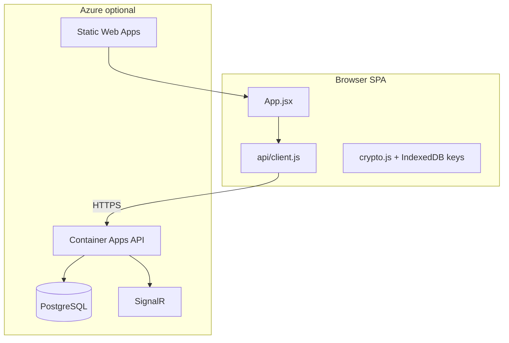

# Aether — Project Summary

## Executive summary

**Aether** is a privacy-oriented dating grid with end-to-end encrypted messaging. The product runs in two modes:

| Mode | When | Experience |
|------|------|------------|
| **Demo** | `VITE_API_URL` unset (e.g. SWA without API var) | Mock profiles, offline auth, local-only data; demo banner shown |
| **Live** | SPA points at Container Apps API + PostgreSQL | Real accounts, profiles, ciphertext storage, SignalR or REST chat |

Repository folder: `optimistic-pasteur`. Product name in UI: **Aether**.

## Architecture overview

## Key components

| Area | Location | Role |
|------|----------|------|
| SPA | `src/` | Grid, chat, profile, privacy settings |
| API | `api/` | Auth, profiles, E2EE ciphertext, media SAS, moderation |
| Infra | `infra/` | SWA, optional backend platform, Key Vault secrets |
| CI/CD | `.github/workflows/` | `ci.yml`, `deploy-app.yml`, `deploy-api.yml`, `terraform.yml` |

## Security highlights

- Web Crypto E2EE for messages; private keys in **IndexedDB** (`keyStorage.js`)
- Production API rejects dev auth bypass and insecure default secrets
- Rate limiting on auth routes; `/health/ready` checks PostgreSQL
- SWA CSP, Permissions-Policy, and frame-ancestors via `staticwebapp.config.json`

## Deployment

See [DEPLOYMENT.md](DEPLOYMENT.md) for demo-only vs full-stack checklists, [BACKEND.md](BACKEND.md) for API routes, and [SECURITY_REVIEW.md](SECURITY_REVIEW.md) for pre-launch review.
